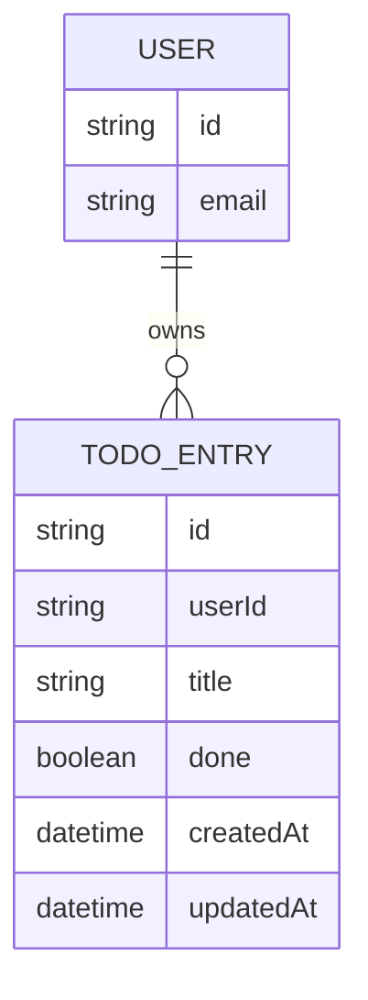

# Domain Model

Each signed-in user owns a private set of to-do entries; nothing else is modeled.

`USER` is the signed-in identity from Thunder (its `id` is the token subject) — no local user table is stored beyond that reference. `TODO_ENTRY.userId` scopes every entry to its owner.